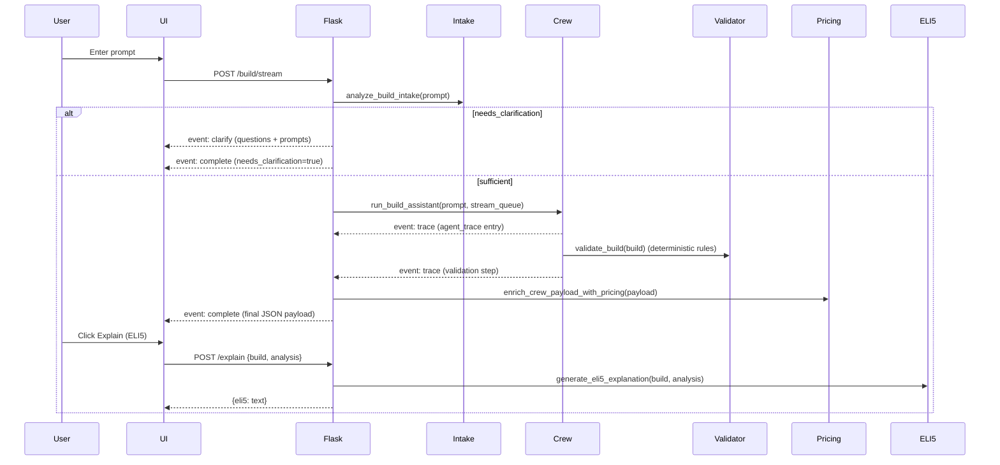

# Gestalt Architecture

This document explains how Gestalt’s pipeline works end to end and where each capability lives in the codebase.

## High-level flow

## Responsibilities by layer

### Flask API layer
File: `app.py`

- **`GET /`**: serves the UI template.
- **`POST /build`**: non-streaming build; returns JSON.
- **`POST /build/stream`**: streaming build; returns **SSE** (`text/event-stream`).
- **`POST /explain`**: ELI5 explanation; returns `{ "eli5": "..." }` or error.

### Intake (pre-build triage)
File: `intake.py`

Purpose: decide whether the user provided enough information to run the build pipeline.

- If insufficient, returns a structured object with:
  - `reason`
  - up to 3 `questions`
  - up to 3 `exploration_prompts`

### Crew pipeline (2 agents + retry loop)
File: `crew.py` and `agents.py`

- **Agent 1 (analysis)** parses the prompt into JSON: budget, use case, constraints.
- **Agent 2 (recommendation)** selects part IDs from the parts catalog.
- The crew loop validates each proposed build and retries up to a fixed number of attempts.
- Each step appends to `agent_trace` and emits a `trace` SSE event when streaming.

### Deterministic compatibility validation
File: `compatibility_checker.py`

Purpose: enforce compatibility rules without relying on the LLM.

Core entrypoint:

- `validate_build(build) -> {"passed": bool, "errors": [...] }`

## Compatibility rules (explicit)

Source of truth: `compatibility_checker.py` (functions `check_*` + `validate_build`).

The validator expects a `build` dict containing these keys:

- `cpu`, `gpu`, `motherboard`, `ram`, `psu`, `case`

Each failure is returned as an object with:

- `code`: stable identifier
- `part`: which part should change
- `message`: human-readable description of the mismatch
- `fix`: plain-English instruction used to guide the next retry

### Rule 1: CPU socket must match motherboard socket

- **Fields used**: `cpu.socket`, `motherboard.socket`
- **Condition**: `cpu["socket"] == motherboard["socket"]`
- **Failure code**: `SOCKET_MISMATCH`
- **Fix hint**: replace CPU or motherboard so sockets match

### Rule 2: RAM DDR generation must be supported by motherboard

- **Fields used**: `ram.ddr_gen`, `motherboard.ddr_support`
- **Condition**:
  - If motherboard supports `"DDR4/DDR5"`: RAM must be `"DDR4"` or `"DDR5"`
  - Else: `ram["ddr_gen"] == motherboard["ddr_support"]`
- **Failure code**: `RAM_GEN_MISMATCH`
- **Fix hint**: choose RAM that matches the motherboard’s supported generation (or choose a motherboard that supports the RAM)

### Rule 3: PSU must have headroom for CPU + GPU plus margin

- **Fields used**: `cpu.tdp`, `gpu.tdp`, `psu.wattage`
- **Load formula** (fixed allowances for platform + RAM):

  \[
  load = cpu.tdp + gpu.tdp + 50 + 10
  \]

- **Pass condition**:

  \[
  psu.wattage \\ge load + 150
  \]

- **Failure code**: `INSUFFICIENT_POWER`
- **Fix hint**: pick a PSU rated at `required` watts or higher (or reduce CPU/GPU power draw)

### Rule 4: GPU must fit in the case (length clearance)

- **Fields used**: `gpu.length_mm`, `case.max_gpu_length_mm`
- **Condition**: `gpu["length_mm"] <= case["max_gpu_length_mm"]`
- **Failure code**: `GPU_CLEARANCE_FAIL`
- **Fix hint**: choose a shorter GPU or a case with a larger max GPU length

### How rule failures influence the next attempt

The crew loop in `crew.py` runs up to a fixed number of recommendation attempts. After each attempt:

1. It builds the candidate parts list from selected IDs.
2. It runs `validate_build(build)`.
3. It appends a `validation` entry to `agent_trace` that includes `passed` and any `errors`.
4. When streaming, that entry is emitted to the UI as `event: trace` so users can see the compatibility check outcome.
5. If validation failed, the next recommendation attempt is prompted with the validator’s fix hint to steer selection.

### Pricing enrichment (live + fallback)
File: `price_comparison.py` (calls `amazon_api.py`, `ebay_api.py`)

Purpose: attach per-part live pricing when possible, otherwise fall back to catalog/list price, and compute rollups used by the UI.

### ELI5 explanation
File: `eli5.py`

Purpose: generate a beginner-friendly explanation of the final build via Gemini (when configured).

## SSE contract (server → browser)

Endpoint: `POST /build/stream`

The stream is **spec-compliant SSE**: frames use `event:` + JSON `data:`. Keepalive comments may be emitted.

### Event types

- **`event: trace`**
  - **data**: a single `agent_trace` entry object (e.g. `{kind: "phase", ...}` or `{kind: "validation", ...}`)
- **`event: clarify`**
  - **data**: `{reason, questions[], exploration_prompts[], original_prompt, merged_prompt, lost_user}`
- **`event: complete`**
  - **data**: final build payload (same shape as `/build` success payload) OR a `{needs_clarification: true, ...}` payload
- **`event: error`**
  - **data**: `{ "message": "..." }`
- **keepalive comment**
  - a comment frame like `: keepalive` (ignored by EventSource)

### Client parsing
The UI’s streaming reader in `templates/index.html` parses:

- `event:` line as the event name
- one or more `data:` lines joined with `\n`, then JSON-parsed

## File map (audit pointers)

- Web server + SSE: `app.py`
- UI + SSE parsing: `templates/index.html`
- UI styling: `static/hexcore.css`
- Intake logic: `intake.py`
- Crew logic + retry loop: `crew.py`
- Agent prompts + model selection: `agents.py`
- Compatibility rules: `compatibility_checker.py`
- Parts data loading: `parts_catalog.py`, `parts.json`
- Pricing enrichment: `price_comparison.py`, `amazon_api.py`, `ebay_api.py`
- ELI5 explanation: `eli5.py`
- Tests: `tests/` (unit tests + e2e HTTP pipeline)

